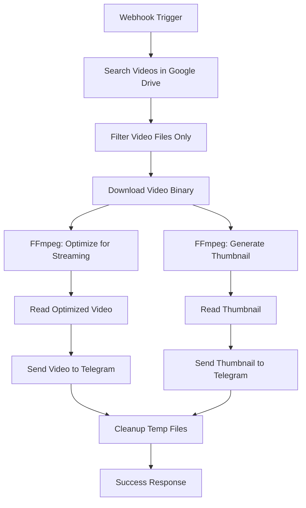

# Telegram Manager Updater - N8N Video Processing Workflow

🎬 **N8N Workflow สำหรับประมวลผลและส่งวิดีโอใน Telegram แบบ Streaming**

## 🌟 Features

- 🔍 **ค้นหาวิดีโอจาก Google Drive** - ค้นหาไฟล์วิดีโอในโฟลเดอร์ที่กำหนด
- ⬇️ **ดาวน์โหลดแบบ Binary** - ดาวน์โหลดไฟล์วิดีโออย่างปลอดภัย
- ⚡ **ปรับแต่งสำหรับ Inline Play** - ใช้ FFmpeg เพื่อทำ `-movflags +faststart` 
- 🖼️ **สร้าง Thumbnail อัตโนมัติ** - สร้างภาพปกจากวิดีโอ
- 📱 **ส่งใน Telegram พร้อม Streaming** - ส่งแบบ Video (ไม่ใช่ Document) พร้อม supports_streaming
- 🎯 **Caption และ Inline Buttons** - มีข้อความและปุ่มสำหรับการจัดการ

## 🛠️ การติดตั้งและตั้งค่า

### 1. ติดตั้ง N8N
```bash
npm install n8n -g
# หรือ
npx n8n
```

### 2. ติดตั้ง FFmpeg
```bash
# Ubuntu/Debian
sudo apt update && sudo apt install ffmpeg

# macOS
brew install ffmpeg

# Windows
# ดาวน์โหลดจาก https://ffmpeg.org/download.html
```

### 3. Import Workflow
1. เปิด N8N Web Interface
2. ไปที่ **Workflows** → **Import from file**
3. เลือกไฟล์ `telegram-video-workflow.json`
4. คลิก **Import**

### 4. ตั้งค่า Credentials

#### Google Drive API
1. ไปที่ [Google Cloud Console](https://console.cloud.google.com/)
2. สร้าง Project ใหม่หรือเลือก Project ที่มี
3. เปิดใช้งาน Google Drive API
4. สร้าง Service Account และดาวน์โหลด JSON key
5. ใน N8N: **Settings** → **Credentials** → เพิ่ม **Google Service Account**

#### Telegram Bot
1. สร้าง Bot ใหม่ผ่าน [@BotFather](https://t.me/botfather)
2. เก็บ **Bot Token**
3. ใน N8N: **Settings** → **Credentials** → เพิ่ม **Telegram**

## 🚀 การใช้งาน

### วิธีที่ 1: Webhook Trigger
```bash
curl -X POST http://localhost:5678/webhook/video-process \
  -H "Content-Type: application/json" \
  -d '{
    "folderId": "YOUR_GOOGLE_DRIVE_FOLDER_ID",
    "telegramChatId": "YOUR_TELEGRAM_CHAT_ID"
  }'
```

### วิธีที่ 2: Manual Execution
1. เปิด Workflow ใน N8N
2. คลิก **Execute Workflow**
3. ใส่ข้อมูล:
   - `folderId`: ID ของโฟลเดอร์ใน Google Drive
   - `telegramChatId`: Chat ID ของ Telegram

## 📋 การทำงานของ Workflow



## 🔧 การปรับแต่ง

### แก้ไข FFmpeg Parameters
```json
{
  "command": "ffmpeg -i \"{{ $json.name }}\" -movflags +faststart -c:v libx264 -preset fast -c:a aac \"optimized_{{ $json.name }}\""
}
```

### เปลี่ยน Thumbnail Time
```json
{
  "command": "ffmpeg -i \"optimized_{{ $json.name }}\" -ss 00:00:05 -vframes 1 -q:v 2 \"thumbnail_{{ $json.name }}.jpg\""
}
```

### Custom Caption Template
```json
{
  "caption": "🎬 {{ $json.name }}\n📁 Size: {{ $json.size }}\n🕐 Duration: {{ $json.duration }}\n⏯️ Ready for streaming!"
}
```

## 📝 หมายเหตุสำคัญ

### เรื่อง Inline Play ใน Telegram
- ✅ **ต้องส่งเป็น Video** (ไม่ใช่ Document)
- ✅ **ต้องมี moov atom ที่หัวไฟล์** (ใช้ `-movflags +faststart`)
- ✅ **ต้องตั้ง `supports_streaming: true`**

### รูปแบบไฟล์ที่รองรับ
- MP4 (แนะนำ)
- AVI
- MKV  
- MOV

### ข้อจำกัด
- ไฟล์วิดีโอต้องไม่เกิน 50MB สำหรับ Telegram Bot API
- สำหรับไฟล์ใหญ่กว่า ควรใช้ Telegram Bot API แบบ local

## 🔍 การแก้ไขปัญหา

### ปัญหาที่พบบ่อย

1. **FFmpeg command not found**
   ```bash
   which ffmpeg
   # ถ้าไม่มี ให้ติดตั้งตาม instructions ข้างต้น
   ```

2. **Google Drive permission denied**
   - ตราสอบ Service Account permissions
   - แชร์โฟลเดอร์ให้กับ Service Account email

3. **Telegram Bot can't send video**
   - ตรวจสอบ Bot Token
   - ตรวจสอบ Chat ID
   - ตรวจสอบขนาดไฟล์ (< 50MB)

4. **Video ไม่เล่น inline**
   - ตรวจสอบว่าใช้ `-movflags +faststart`
   - ตรวจสอบว่าส่งเป็น Video ไม่ใช่ Document
   - ตรวจสอบ `supports_streaming: true`

## 📞 การสนับสนุน

หากมีปัญหาหรือข้อเสนอแนะ:
- สร้าง Issue ใน GitHub Repository
- ติดต่อผ่าน Telegram
- อ่าน N8N Documentation

## 📄 License

MIT License - ดู LICENSE file สำหรับรายละเอียด