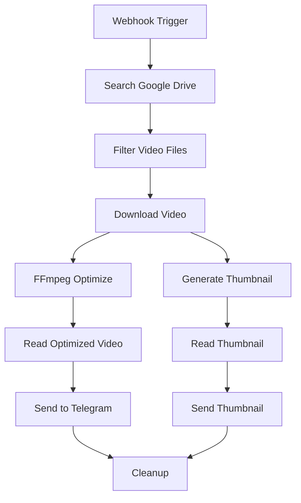
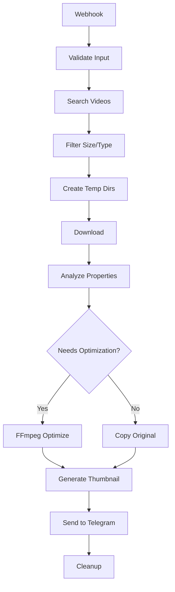

# Technical Documentation - Telegram Video Processing Workflow

## Architecture Overview

This N8N workflow implements a complete video processing pipeline that:

1. **Searches** for videos in Google Drive folders
2. **Downloads** them as binary data
3. **Optimizes** them for Telegram streaming using FFmpeg
4. **Generates** thumbnails automatically
5. **Sends** to Telegram with full streaming support

## Key Technical Requirements for Telegram Inline Play

### Critical: moov atom positioning
For videos to play inline in Telegram, they **must** have the `moov` atom at the beginning of the file. This is achieved using:

```bash
ffmpeg -i input.mp4 -movflags +faststart -c copy output.mp4
```

### Video Format Requirements
- **Format**: MP4 container (recommended)
- **Video Codec**: H.264 (x264)
- **Audio Codec**: AAC
- **Max File Size**: 50MB (Telegram Bot API limit)
- **Streaming Flag**: `supports_streaming: true` in API call

## Workflow Components

### 1. Basic Workflow (`telegram-video-workflow.json`)



### 2. Advanced Workflow (`advanced-telegram-video-workflow.json`)

Enhanced version with:
- Input validation
- Video analysis (ffprobe)
- Smart processing decisions
- Better error handling
- Comprehensive logging



## FFmpeg Processing Strategies

### 1. Stream Copy (Fast)
When video is already in optimal format:
```bash
ffmpeg -i input.mp4 -movflags +faststart -c copy output.mp4
```

### 2. Re-encoding (Quality)
When codec conversion is needed:
```bash
ffmpeg -i input.mp4 -movflags +faststart -c:v libx264 -preset fast -crf 23 -c:a aac output.mp4
```

### 3. Thumbnail Generation
Smart thumbnail from 25% into video:
```bash
ffmpeg -i input.mp4 -ss 00:00:05 -vframes 1 -q:v 2 -vf "scale=320:240:force_original_aspect_ratio=decrease" thumbnail.jpg
```

## API Endpoints

### Basic Workflow
```http
POST /webhook/video-process
Content-Type: application/json

{
  "folderId": "1BxiMVs0XRA5nFMdKvBdBZjgmUUqptlbs67",
  "telegramChatId": "123456789"
}
```

### Advanced Workflow
```http
POST /webhook/video-process-advanced
Content-Type: application/json

{
  "folderId": "1BxiMVs0XRA5nFMdKvBdBZjgmUUqptlbs67", 
  "telegramChatId": "123456789",
  "limit": 5
}
```

## Response Formats

### Success Response
```json
{
  "status": "success",
  "message": "Video processed and sent successfully",
  "filename": "video.mp4",
  "fileId": "1BxiMVs0XRA5nFMdKvBdBZjgmUUqptlbs67",
  "processingMode": "copy",
  "optimized": true,
  "videoInfo": {
    "duration": 120.5,
    "width": 1920,
    "height": 1080,
    "fps": 30,
    "videoCodec": "h264",
    "audioCodec": "aac"
  }
}
```

### Error Response
```json
{
  "status": "error",
  "message": "No valid video files found or files exceed 50MB limit"
}
```

## Configuration Options

### Google Drive Integration
- **Service Account**: Required for API access
- **Folder Permissions**: Service account must have read access
- **MIME Type Filtering**: `video/*` content types
- **File Size Limits**: 50MB max for Telegram

### Telegram Bot Configuration
- **Bot Token**: From @BotFather
- **Chat ID**: Target chat/channel
- **Message Format**: HTML parsing enabled
- **Inline Keyboards**: Action buttons included

### FFmpeg Parameters

#### Video Optimization
```json
{
  "fastCopy": "ffmpeg -i {input} -movflags +faststart -c copy {output}",
  "reEncode": "ffmpeg -i {input} -movflags +faststart -c:v libx264 -preset fast -crf 23 -c:a aac {output}"
}
```

#### Thumbnail Generation
```json
{
  "command": "ffmpeg -i {input} -ss {timestamp} -vframes 1 -q:v 2 -vf scale=320:240 {output}",
  "timestamp": "25%",
  "quality": 2,
  "size": "320x240"
}
```

## Performance Considerations

### File Processing
- **Temporary Storage**: Uses `/tmp/n8n-video-{id}` directories
- **Cleanup**: Automatic cleanup after processing
- **Memory Usage**: Streams large files to avoid memory issues
- **Concurrent Processing**: Limited by N8N workflow instances

### Optimization Strategies
1. **Stream Copy First**: Try copy operation before re-encoding
2. **Format Detection**: Use ffprobe to analyze input
3. **Smart Thumbnails**: Generate at optimal timestamp
4. **Batch Processing**: Process multiple videos in sequence

## Error Handling

### Common Issues
1. **FFmpeg Not Found**
   - Solution: Install FFmpeg in system PATH
   
2. **Google Drive Permission Denied**
   - Solution: Share folder with service account email
   
3. **Telegram File Size Exceeded**
   - Solution: Implement video compression or splitting
   
4. **Invalid Video Format**
   - Solution: Add format conversion logic

### Monitoring and Logging
- **Workflow Execution**: N8N built-in logging
- **FFmpeg Output**: Captured in command execution nodes
- **Error Propagation**: Proper error handling chains
- **Status Reporting**: Webhook response indicates success/failure

## Security Considerations

### Credentials Management
- **Service Accounts**: Use least privilege principle
- **Bot Tokens**: Store securely, rotate regularly
- **File Access**: Validate file types and sizes
- **Webhook Security**: Consider authentication middleware

### File Safety
- **Temporary Files**: Clean up after processing
- **Input Validation**: Check file types and sizes
- **Path Traversal**: Use absolute paths for temp files
- **Resource Limits**: Prevent resource exhaustion

## Scaling and Production Deployment

### Horizontal Scaling
- **Multiple N8N Instances**: Load balance webhook calls
- **Worker Nodes**: Distribute FFmpeg processing
- **Queue System**: Add Redis queue for high volume

### Infrastructure Requirements
- **CPU**: Multi-core for FFmpeg processing
- **Memory**: 2GB+ RAM recommended
- **Storage**: Temp space for video processing
- **Network**: Bandwidth for Google Drive/Telegram API

### Monitoring
- **Health Checks**: Webhook endpoint monitoring
- **Performance Metrics**: Processing time tracking
- **Error Alerting**: Failed workflow notifications
- **Resource Usage**: CPU/memory monitoring

## Customization Examples

### Custom Video Filters
```bash
# Add watermark
ffmpeg -i input.mp4 -i watermark.png -filter_complex "overlay=10:10" -movflags +faststart output.mp4

# Resize video
ffmpeg -i input.mp4 -vf "scale=720:480" -movflags +faststart output.mp4

# Add intro/outro
ffmpeg -i intro.mp4 -i main.mp4 -i outro.mp4 -filter_complex concat=n=3:v=1:a=1 -movflags +faststart output.mp4
```

### Custom Telegram Messages
```json
{
  "caption": "🎬 <b>{filename}</b>\n📊 {width}x{height} • {duration}s\n💾 {filesize}\n🔧 Optimized for streaming",
  "parse_mode": "HTML",
  "reply_markup": {
    "inline_keyboard": [
      [{"text": "📂 Source", "url": "{drive_url}"}],
      [{"text": "🔄 Reprocess", "callback_data": "reprocess_{id}"}]
    ]
  }
}
```

### Batch Processing
```json
{
  "folderId": "folder_id",
  "telegramChatId": "chat_id", 
  "filters": {
    "maxSize": "50MB",
    "minDuration": 10,
    "fileTypes": ["mp4", "mov", "avi"]
  },
  "processing": {
    "batchSize": 5,
    "delay": 2000,
    "priority": "size_asc"
  }
}
```

This technical documentation provides the foundation for understanding, deploying, and customizing the Telegram video processing workflow.